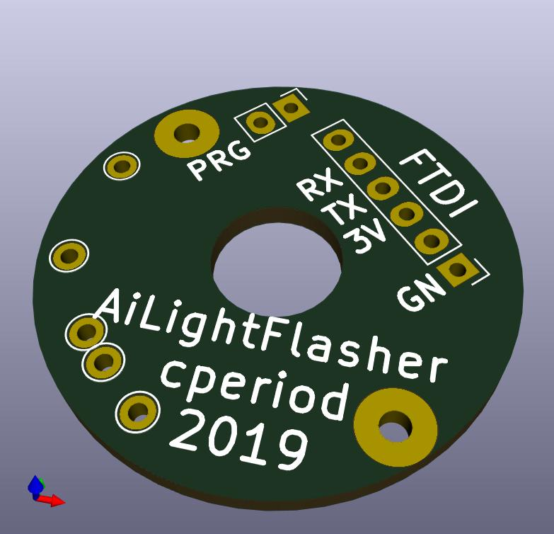
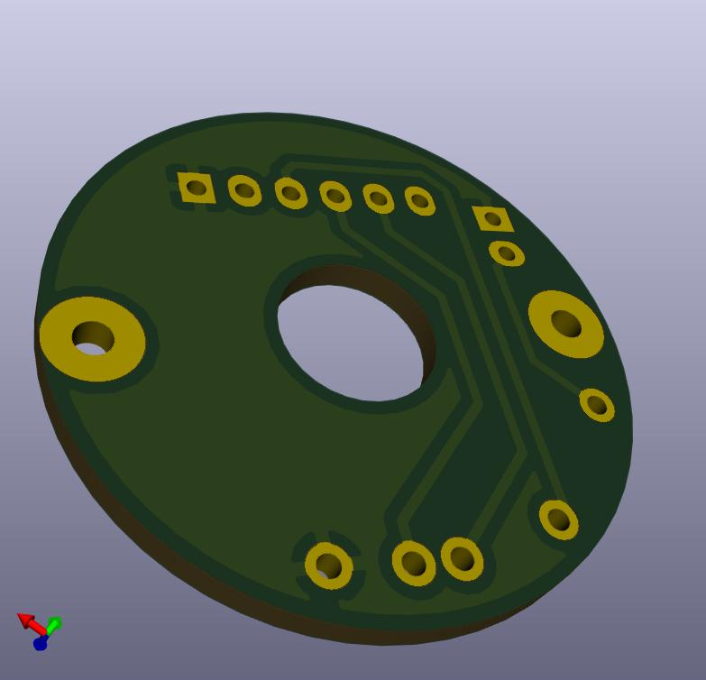
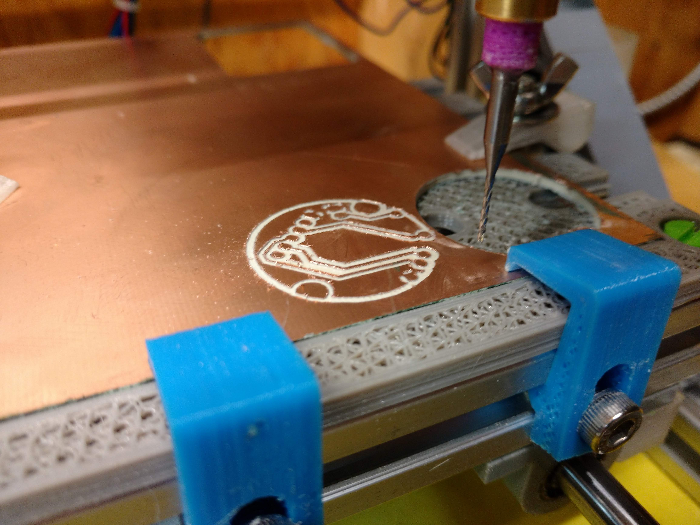
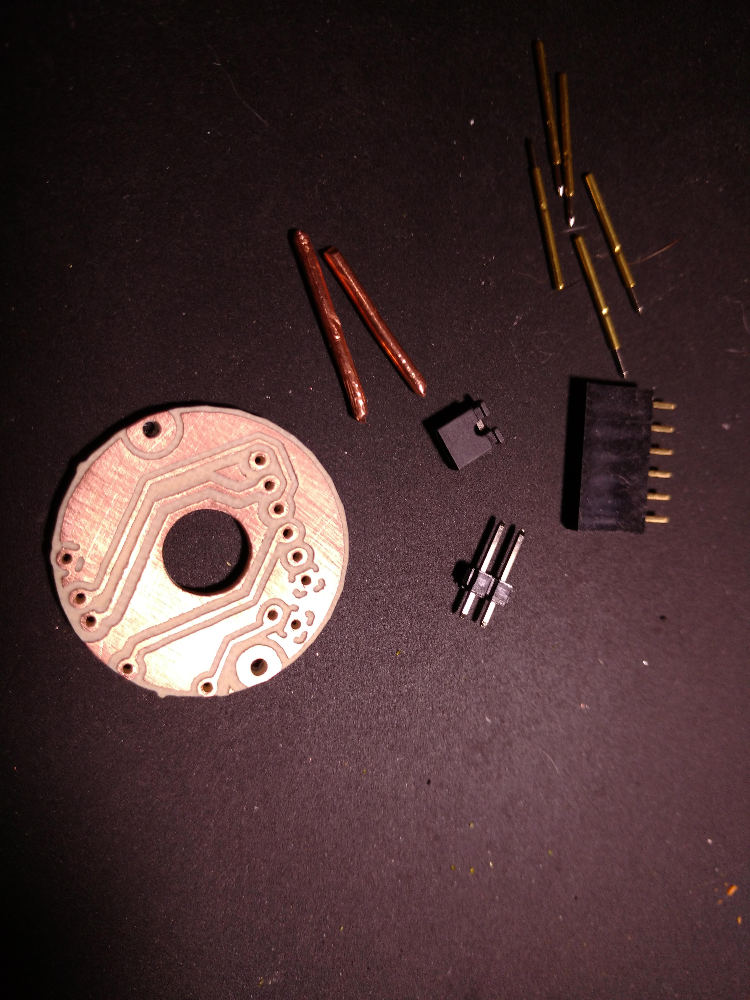
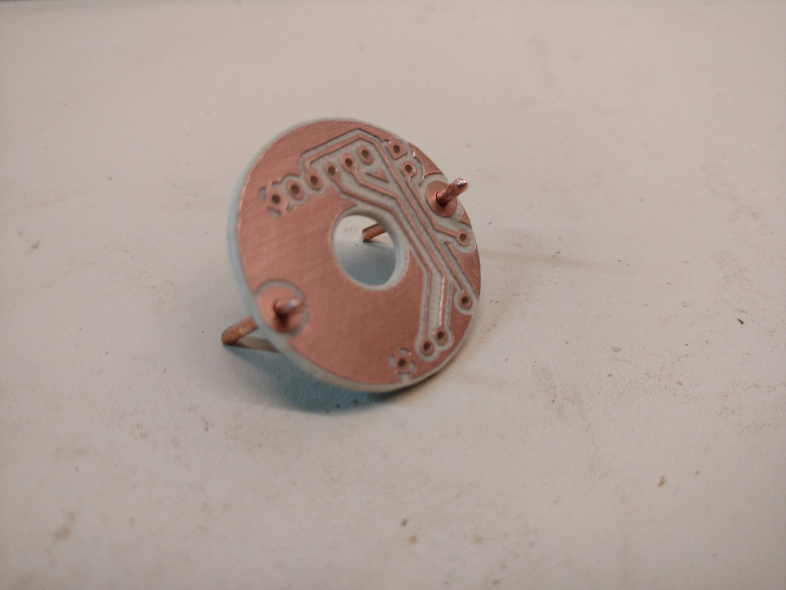
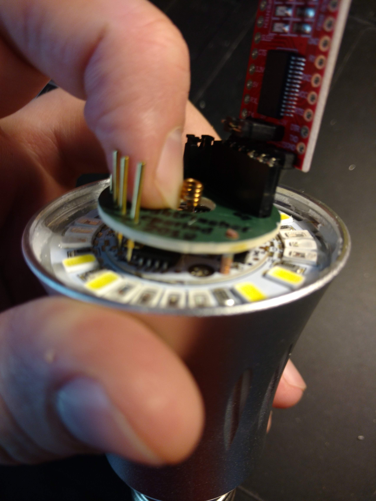

# Overview

This is a simple programming/flashing PCB for an AiLight ESP-8266 "smart
bulb". It's not the first and probably not the best, but I'm happy with it.

 

There are some designs that use pogo pins in 3D-printed "frames".
[I tried one; didn't like](Pictures/IMG_20190811_100513.jpg).
Alignment is difficult, and it really needs both hands to
position and hold. Precision in 3D printing isn't really high enough to get
the pins to line up exactly.

But in the spirit of "when all you have is a hammer", I have a PCB mill...

# Design

The alignment problem is addressed using a couple of pins which fit into
a pair of holes in the the AiLight board. It turns out that 14 gauge
copper electrical wire with a slightly rounded tip fits these holes
precisely enough that the pogo pins will easily hit their target pads.

Otherwise, it's just a simple breakout board for the standard 6-pin FTDI
header, with a jumper to control whether it's in flash mode (disabling
flash is useful to see if the programming worked).
 
# Manufacturing

I milled it on my 1610 CNC using a 0.5mm V-bit with 1.0mm drill plus a 1.2mm
bit for the larger holes and outline. Your workflow may vary. The front
"silk screen" was done with a marker held
[in a pen holder](https://www.thingiverse.com/thing:2851655).

You could likely send the project to a board manufacturer, but be aware
that I may not have handled the internal cutout properly. Clearances are
designed for coarse PCB milling, so it should fall well within the design rules
of any manufacturer.

# Parts

1. PCB
2. (5) pogo pins, 1mm OD
3. two pieces of 14 gauge copper wire (1.7mm dia) approx 10cm long,
tips slightly rounded
4. 1x06 socket strip (right angle pins might be better, haven't tried)
5. 1x02 pin header and jumper

The wire pins should be long enough to insert and handle while soldering.
Rounding the tips can be done by holding them in a drill chuck and running
it against a file.

# Assembly

Start with the alignment pins. I went with approx 5mm projection on the
back side of the board. Solder.

Solder the pogo pins next. I found them to be a tight fit. The tips should
project just slightly further (maybe 0.5mm) than the alignment pins. You
might want to check the fit against an actual board since the necessary
projection depends on how pointy you make the alignment pins.

Solder the rest of the components.

# Using

I can hold it single-handed. Connect the FTDI board, align the
pins, press down slightly on the pogo pin side, connect the USB, and flash
from whatever IDE you're using. Remove the jumper if you need to check the
results (you may need to disconnect/reconnect the FTDI cable).
